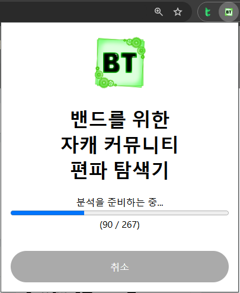
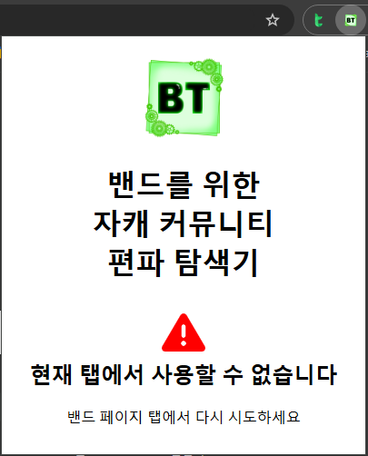
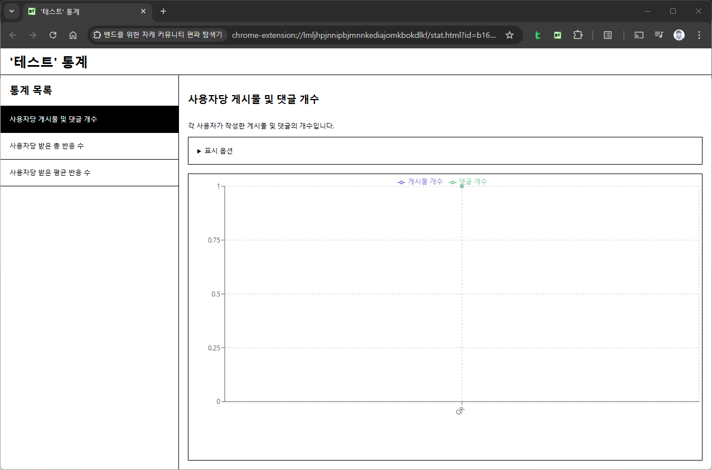

# 밴드를 위한 자캐 커뮤니티 편파 탐색기

Original Character Community Troll Finder for Band (OCTrollFinder4Band)

커뮤 내 게시물과 반응 데이터를 분석하여 특정 자캐의 편파 여부를 진단하고, 공정한 운영을 돕는 도구입니다.

## 실행 화면

아래 환경에서 [실행 방법](#실행-방법) 문단의 설명에 따라 실행한 화면입니다.

-   운영 환경: (없음)
-   테스트 환경: 개인 PC

<!--유튜브의 경우: -->

## 실행 방법

### Web Store에서 설치

-   Chrome: [Chrome Web Store](https://chromewebstore.google.com/detail/djkoblkifcbolejdhilafnnhblnbibid)에 접속한 뒤, `Chrome에 추가` 버튼을 클릭하여 설치를 진행합니다.
<!-- - Firefox: [Firefox Add-ons]()에 접속한 뒤, `Firefox에 추가` 버튼을 클릭하여 설치를 진행합니다. -->

### Releases에서 설치

**경고: Releases에는 정식 버전뿐 아니라 테스트 버전도 함께 배포됩니다. 테스트 버전은 정식 버전에 비해 불안정할 수 있으며, '어뷰징으로 인한 이용 제한' 등 밴드 이용에 문제를 일으킬 만한 버그가 있을 수 있습니다. 이 프로젝트에서는 이 버전을 설치하여 발생하는 문제에 책임지지 않습니다.**

1. [Releases](https://github.com/Quirax/OCTrollFinder4Band/releases)에 게시된 최신 버전의 zip 파일을 다운로드합니다.
2. Chrome에서 `chrome://extensions`로 들어갑니다.
3. 우측 상단 `개발자 모드`를 활성화합니다.
4. 다운로드한 zip 파일을 화면에 드래그하여 설치합니다.

### 분석 진행 과정

<!-- TODO:
1. "표시 옵션" 관련 설명 추가
-->

1.  **확장 프로그램이 설치된 브라우저(예를 들어, Chrome)에서** 분석을 진행할 밴드 페이지를 엽니다.
2.  밴드 페이지 탭을 표시하는 상태에서 확장 프로그램을 실행합니다. 창 우측 상단 '확장 프로그램' 아이콘을 클릭한 뒤, 표시되는 목록에서 `밴드를 위한 자캐 커뮤니티 편파 탐색기`를 클릭하면 됩니다.
3.  표시된 팝업 화면에서 `현재 밴드 분석하기` 버튼을 클릭합니다.
4.  분석을 준비한 뒤 새 탭으로 분석 화면이 표시될 때까지 기다립니다.
5.  분석 화면 좌측의 통계 종류를 선택하여 원하는 통계 분석을 확인합니다.

### 표시 옵션

통계 화면의 `표시 옵션`을 클릭하면 위와 같은 옵션이 표시됩니다. 이 옵션을 통해 통계 화면을 원하는 대로 조정할 수 있습니다.

-   정렬 기준: 사용자를 표시하는 순서의 기준을 설정합니다. 예를 들어, `총합`을 선택하면, 해당 통계에서 다루는 모든 값의 총합을 기준으로 정렬합니다. 기본적으로 오름차순이며, `역순`에 체크하는 경우 내림차순으로 정렬합니다.
-   기간: 특정 기간에 게시된 게시물에 대해서만 통계합니다. 게시물에 부속된 댓글의 경우 이 옵션으로 설정한 기간에 관계 없이 적용됩니다.
-   표시할 항목: 표시할 항목을 설정합니다. 체크되어 있는 항목만 그래프에 표시됩니다.

### 문제 해결

-    만약 팝업에서 위와 같은 메시지가 표시되거나 밴드 정보가 표시되지 않는다면, 밴드 페이지를 새로고침한 뒤, 해당 페이지 탭을 표시하는 상태에서 다시 확장 프로그램을 실행합니다.
-    만약 분석 준비가 진행되는 도중 진행이 멈췄다면, `취소` 버튼을 클릭해 되돌아간 다음 다시 시도합니다. 그래도 동일한 현상이 발생한다면, 밴드 페이지를 새로고침한 뒤 다시 시도합니다.
-    만약 그래프가 제대로 표시되지 않는다면, 이는 해당되는 자료가 없는 것일 수 있으므로 밴드 페이지에서 확인해봅니다.

만약 문제가 해결되지 않는다면, Issues 탭에서 버그 리포트를 작성해주시면 감사하겠습니다.

## 배경

자작 캐릭터(자캐)를 기반으로 한 커뮤니티(커뮤)는 창작자들이 밴드와 같은 플랫폼을 활용해 상호작용하며 운영됩니다. 그러나 특정 자캐만 우대받는 편파 문제로 인해 참여자 간 갈등이 발생하거나 커뮤 운영에 어려움이 생길 수 있습니다. 이를 해결하기 위해 커뮤 내 게시물과 반응 데이터를 분석하여 편파 여부를 객관적으로 확인할 수 있는 도구가 필요합니다.

"밴드를 위한 자캐 커뮤니티 편파 탐색기"는 이러한 문제를 해결하기 위해 데이터 기반으로 편파 여부를 진단하고, 커뮤 운영을 효율적으로 지원하기 위한 도구로 설계되었습니다.

자세한 내용은 [docs/background.md](./docs/background.md)를 참조하시기 바랍니다.

## 동작 원리

"밴드를 위한 자캐 커뮤니티 편파 탐색기"는 커뮤에서 수집된 게시물과 반응 데이터를 활용해 캐릭터별 활동량과 반응을 분석합니다. 이를 통해 특정 캐릭터가 우대받거나 소외되는지 객관적으로 확인할 수 있습니다. 데이터 시각화를 통해 편파 여부를 명확히 보여주며, 분석 결과는 운영자가 공정성을 유지하고 커뮤를 효과적으로 관리하는 데 도움을 줍니다.

자세한 동작 원리에 대한 설명은 [docs/techincal-details.md](./docs/technical-details.md)를 참조하시기 바랍니다.

## 목표 및 현황

-   ❎️ 작업이 시작되지 않았으며, 당분간 계획 없음
-   🗑 폐기된 목표
-   🗓 작업이 시작되지 않았으나, 계획에는 포함됨
-   🛠 작업이 시작되었음
-   ✅️ 작업이 완료되었음

---

-   ✅️ 페이지 간 통신
    -   ✅️ 팝업-Content Script 간 통신
    -   ✅️ 팝업-Service Worker 간 통신
    -   ✅️ CS-Inject Script 간 통신
-   ✅️ 밴드 정보, 게시물 및 댓글 목록 수집
    -   ✅️ Band API에 접근
    -   ✅️ 밴드 정보에 접근
    -   ✅️ 게시물 목록에 접근
    -   ✅️ 댓글 목록에 접근
-   ✅️ Stat 페이지에서 분석
    -   ✅️ 데이터 전달
    -   ✅️ 분석 및 그래프로 표시
-   ❎️ 설정
-   ❎️ DevTools

## 한계

-   상기한 바와 같이 밴드 페이지에 스크립트를 주입하는 방식으로 구현되어 있어, 추후 밴드 운영사인 네이버 사에서 보안 위협으로 간주하고 이를 차단할 가능성이 있습니다. 이 경우 Open API를 비롯한 다른 방식으로 다시 개발할 예정입니다.
-   밴드에 미리 로그인한 뒤, 밴드 페이지가 열려 있는 상태에서만 분석 진행이 가능합니다. 팝업에서 소속된 밴드를 선택할 수 없습니다.
-   로그인한 사용자의 자격으로 밴드 API를 사용하므로, 사용량이 많은 경우 밴드 측에서 어뷰징으로 간주하여 24시간 동안 이용이 제한될 수 있습니다. 개발 과정에서 실시한 내부 테스트 결과, 게시물 약 250개 기준으로는 문제가 발생하지 않았습니다. 그러나 이것이 곧 언제나 이용 제한이 발생하지 않는다고 보장하지는 않습니다.

## 하고 싶은 말

이 확장 프로그램의 개발 과정에는 소중한 분들의 지원이 있었습니다.

-   **[연화](https://x.com/F0r_commu_)**: 확장 프로그램의 초기 아이디어를 제공하고, 검증 과정에 참여하며 피드백을 제공해주셨습니다. 커뮤에 관한 아이디어나 운영 경험이 풍부한 분입니다. 깊은 감사의 뜻을 전합니다.
-   **[김23](https://bsky.app/profile/kimesam.bsky.social)**: 확장 프로그램의 아이콘 디자인을 맡아주셨습니다. 커뮤 운영 경험과 자캐 제작 노하우도 갖추고 있는 분입니다. 진심으로 감사드립니다.

이 외에도 프로젝트에 직&middot;간접적으로 도움을 주신 모든 분들께 감사드립니다.

필요한 통계나 기능에 대한 아이디어는 언제든 환영합니다. Issues 탭을 통해 제안해주시면 감사하겠습니다.

## 개인정보처리방침

이 확장 프로그램의 개인정보처리방침은 [docs/privacy-policy.md](./docs/privacy-policy.md)를 참조하시기 바랍니다.
